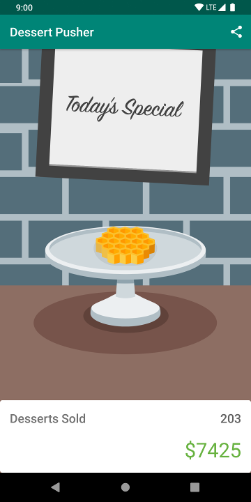

# Activity Lifecycle - DessertPusher 

This is the toy app for lesson 4 of the [Android App Development in Kotlin course on Udacity](https://classroom.udacity.com/courses/ud9012/lessons/e487c600-ed68-4576-a35a-12f211cf032e/concepts/6a155d63-8153-4a56-95cb-1dfdf06aa173).

## DessertPusher

DessertPusher is a game about making desserts. Press the button, make a dessert, earn the big bucks.

This app is for exploring the [Activity Lifecycle callback methods](https://developer.android.com/guide/components/activities/activity-lifecycle) and the [Lifecycle](https://developer.android.com/reference/android/arch/lifecycle/Lifecycle) object.

## Screenshots

  

## About this app
Welcome to my Git repository for the DessertPusher app, which I built as part of my Android development journey!

I recently completed the Android lifecycles lesson and gained valuable insights into the activity lifecycle. This knowledge was crucial for creating stable activities and fragments, and I put it into practice by building the DessertPusher app.

Through the process of building this app, I was able to explore the Activity Lifecycle callback methods and the Lifecycle object, which helped me better understand how to manage lifecycles effectively. I also learned how to handle common pitfalls and issues that may arise, which will undoubtedly come in handy for future projects.

I'm excited to continue developing my skills in Android development and leveraging my newfound understanding of lifecycles to build better, more stable apps. Thank you for visiting my repository, and I hope you enjoy exploring my code!

## Report Issues
Notice any issues with a repository? Please file a [github issue](https://github.com/udacity/andfun-kotlin-dessert-pusher/issues) in this repository.
# dessert-pusher

